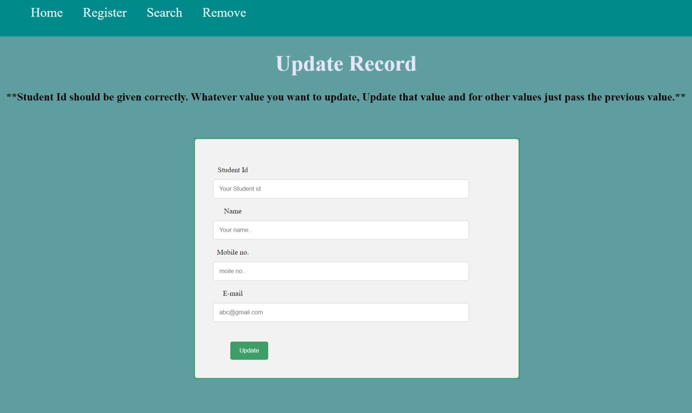
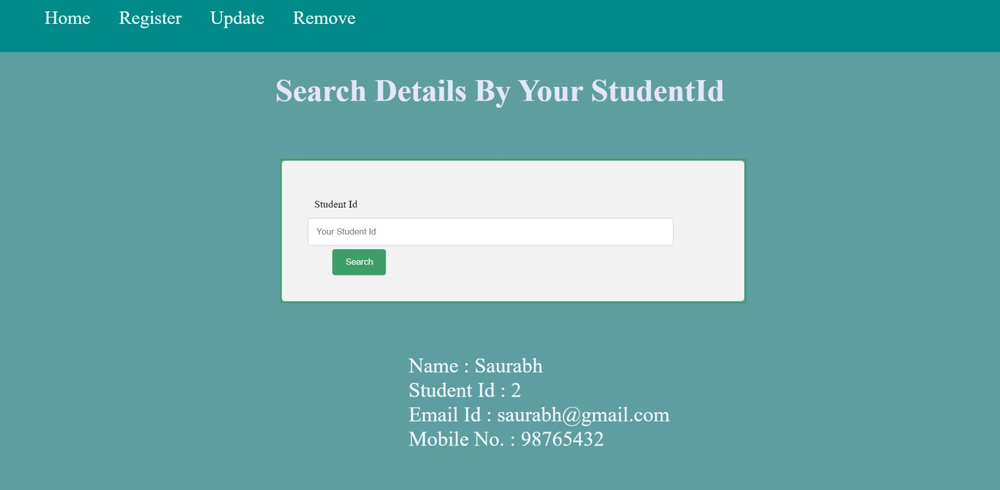
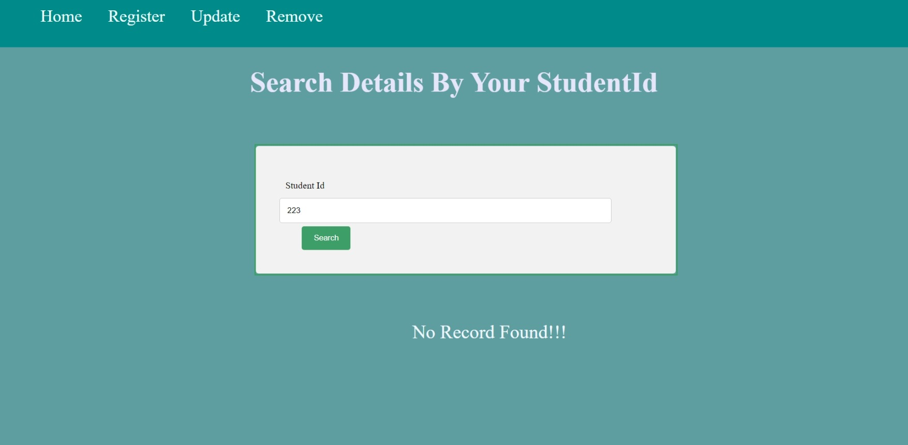

# "This project "Student Management System"  is made with the help of JsonPowerDB (JPDB)." #
## This system, Student Management System, provides advanced functionality run the daily basic requirement for the school program. The system can be manipulated by one user as an admin. ##
**About JsonPowerDB:**
- JsonPowerDB is a Real-time, High Performance, Lightweight and Simple to Use, Rest API based Multi-mode DBMS.
- JsonPowerDB has ready to use API for Json document DB, RDBMS, Key-value DB, GeoSpatial DB and Time Series DB functionality.
-  JPDB supports and advocates for true serverless and pluggable API development.
-  JPDB is build around _world's fastest indexing engine_ __PowerIndex__

**Benefits of using JsonPowerDB**
- Simplest way to retrieve data in a JSON format.
- Schema-free, Simple to use, Nimble and In-Memory database.
- It is built on top of one of the fastest and real-time data indexing engine - PowerIndeX.
- It is low level (raw) form of data and is also human readable.
- It helps developers in faster coding, in-turn reduces development cost.

## Screenshots: ##
.png)

.png)

.jpeg)

.png)

.png)

.png)

### If the data is not found, gives the following result: ###

